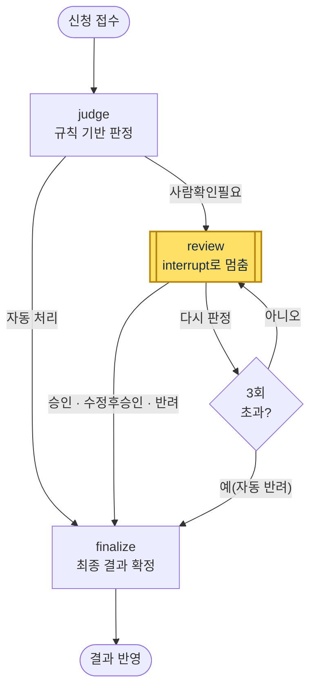
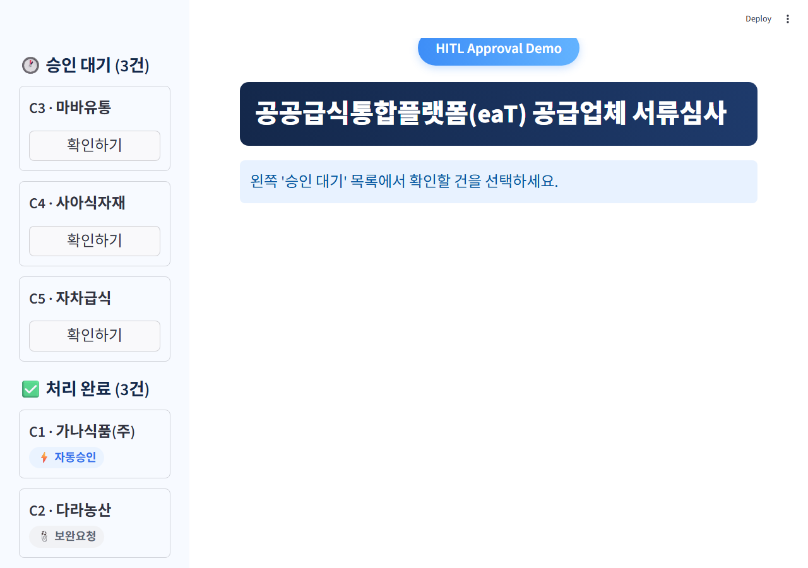
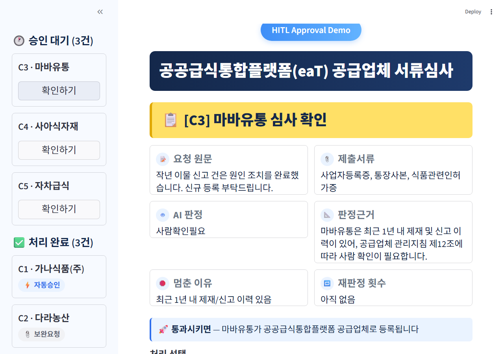

# REPORT — eaT 공급업체 서류심사 HITL 승인 에이전트

## 1. 주제와 고른 이유

공공급식통합플랫폼(eaT)의 신규 공급업체 등록 서류심사 업무를 자동화 대상으로 골랐습니다.
결과가 바깥으로 나가는 지점은 **"공급업체로 등록 확정"** 되는 순간입니다. 등록이 되면 해당
업체는 플랫폼을 통해 실제 거래·정산이 가능해지므로 되돌리기 어렵고, 제재이력이나 서류상
불일치가 있는 업체를 잘못 등록시키면 이후 민원·감사 대상이 될 수 있습니다. 따라서 등록
확정 직전 단계를 HITL 자리로 잡았습니다.

(실습에서 다룬 환불 승인 주제는 제외했습니다.)

## 2. 파이프라인 구조도

- **judge의 자동 처리 두 갈래**: 필수서류 누락 → 보완요청 / 필수서류 충족 + 특이사항 없음 → 자동승인
  (둘 다 사람을 거치지 않고 finalize로 직행). 제재이력·주소불일치·인허가 임박·만료 중 하나라도
  있으면 사람확인필요로 판정되어 노란색 review(HITL 게이트)로 이동. 다시 판정을 누르면 별도의
  3회 초과 여부 노드에서 갈라져 review로 되돌아가거나(3회 미만) 자동 반려로 빠짐(3회 초과)
- **State**: `case`(신청 정보), `verdict`/`reason`/`stop_reasons`(judge 결과), `decision`(담당자 응답),
  `retry_count`, `final_status`/`final_reason`/`final_conditions`(최종 결과)
- **judge 내부 분리**: 자동승인/보완요청/사람확인필요 여부(`verdict`)는 여전히 규칙(필수서류·제재이력·
  주소불일치·인허가 임박·만료)으로만 계산 — HITL 게이트가 계산 불가능한 LLM 판단에 좌우되지 않도록
  분리. 그 판정을 사람이 읽을 문장으로 설명하는 `reason`만 OpenAI Chat Completions API(`llm_judge.py`,
  기본 모델 `gpt-4o-mini`)로 생성하고, 관련 규정 인용을 함께 붙임. API 키가 없거나 호출이 실패하면
  규칙 기반 기본 문구로 자동 대체
- **멈추는 지점**: `review` 노드의 `interrupt()` — judge가 "사람확인필요"로 판정한 건만 도달
- **재개 경로**: 담당자 응답을 `Command(resume=answer)`로 넣으면 `review` 노드가 처음부터
  재실행되어 `answer`를 받아 다음 단계(등록 확정 또는 재검토 반복)로 분기
- **영속화**: `thread_id = case_id`로 SqliteSaver에 저장 — 프로그램을 껐다 켜도 대기 중인 건이 남음

## 3. 승인 기준과 그 이유

| 기준 (계산 가능한 형태) | 막으려는 위험 |
|---|---|
| 최근 1년 내 제재/신고 이력이 있음 | 문제가 반복될 가능성이 있는 업체를 자동으로 다시 등록시키는 것을 막음 |
| 사업자등록 주소 ≠ 실제 시설 소재지 | 서류상 위장/오기 가능성 — 실제 운영 장소를 사람이 한 번 더 확인 |
| 인허가증 유효기간이 30일 이내로 임박했거나 이미 만료됨 | 등록 시점엔 유효해도 곧 무자격 상태가 될 업체를 그대로 흘려보내는 것을 막음 |

자동으로 처리되는 두 건은 사람이 보지 않아도 되는 이유가 명확합니다.

- **필수서류(사업자등록증/통장사본/식품관련인허가증) 누락 → 자동 보완요청**: 등록 자체가
  일어나지 않으므로(서류 재제출 요청만 나감) 되돌릴 수 없는 결과가 없음
- **필수서류 충족 + 위 세 기준에 전혀 해당하지 않음 → 자동승인**: 위험 신호가 하나도 없는
  경우이므로, 모든 건을 사람이 보게 하면 개입률만 높아지고 정작 위험한 건에 쓸 시간이
  줄어듦(헛멈춤)

## 4. 실행 결과

모의 케이스 6건을 처리한 결과입니다 (Streamlit 데모, SqliteSaver로 영속화, 서버 재시작 후에도
대기 건이 유지되는 것까지 확인).

| 케이스 | 업체 | AI 판정 | 사람 개입 | 담당자 처리 | 최종 결과 |
|---|---|---|---|---|---|
| C1 | 가나식품(주) | 자동승인 | 없음 | - | 자동승인 |
| C2 | 다라농산 | 보완요청 | 없음 | - | 보완요청 |
| C3 | 마바유통 | 사람확인필요(제재이력) | O | 승인 | 승인 |
| C4 | 사아식자재 | 사람확인필요(주소불일치) | O | 수정 후 승인 | 조건부승인 (실제 시설 주소 현장확인 후 3개월만 등록) |
| C5 | 자차급식 | 사람확인필요(인허가 임박) | O | 반려 | 반려 |
| C6 | 카타물산 | 사람확인필요(인허가 만료) | O | 다시 판정 ×3 | 반려(재판정 3회 초과 자동 반려) |

- 총 6건 중 **2건은 사람을 거치지 않고 자동 처리**, **4건이 멈춰 사람 확인**을 받음 (개입률 4/6)
- 놓침(사람이 봤어야 하는데 자동 처리된 건): 없음 — 세 기준 중 하나라도 해당하면 전부 멈춤
- 헛멈춤(안 봐도 됐는데 멈춘 건): 0건으로 판단 — 4건 모두 실제로 담당자 판단이 갈린 사례
  (승인/조건부승인/반려/반복재검토 후 반려)

**개선 전 → 후 비교 (판정근거 문구)**: judge의 verdict(자동승인/보완요청/사람확인필요)는 처음부터
끝까지 규칙으로 고정했지만, 그 근거를 사람에게 설명하는 `reason` 문장은 개발 중 규칙 기반
고정 문구에서 OpenAI API 생성으로 바꿨습니다. 같은 C3 케이스로 비교하면:

| | 판정근거(reason) |
|---|---|
| 개선 전 (규칙 기반 고정 문구) | "필수서류는 충족했으나 특이사항 확인이 필요함" |
| 개선 후 (OpenAI API 생성, `llm_judge.py`) | "마바유통은 최근 1년 내 제재 및 신고 이력이 있어, 공급업체 관리지침 제12조에 따라 사람 확인이 필요합니다." |

개선 후 쪽이 왜 멈췄는지와 관련 규정을 담당자에게 한 문장으로 설명해 주므로, 승인 화면만
보고도 판단할 수 있는 정보가 늘어납니다. OpenAI 키가 없거나 호출이 실패하면 자동으로 개선
전 문구로 되돌아가도록 만들어(`llm_judge.py`의 `_fallback_reason`), 이 변경이 데모 가용성을
해치지 않게 했습니다.

**견고성**: `retry_count`가 3회를 넘으면 "다시 판정"을 더 받지 않고 자동 반려로 강제 종료시키는
장치 외에, 그래프 실행 자체에도 `recursion_limit=50`을 걸어 두어(`cli.py`/`app.py`의
`invoke` 호출) 코드에 버그가 생기더라도 무한 루프로 이어지지 않도록 이중으로 막았습니다.
개발 중 실제로 담당자 입력이 1~4 중 어느 것과도 맞지 않는 경우(빈 문자열 등)를 만들었는데,
`cli.py`가 이를 예외로 터뜨리는 대신 "다시 판정"으로 안전하게 처리하는 것을 확인했습니다.

## 5. 데모 화면 설계

`streamlit run app.py`로 실행하는 화면 구성:

- **왼쪽 사이드바**: "승인 대기 (N건)" 목록(버튼) + "처리 완료 (N건)" 목록(케이스·결과 요약)
- **상세 화면(선택한 건)**에 보여주는 것: 요청 원문, 제출서류 목록, AI 판정, 판정근거,
  멈춘 이유, "통과시키면 무슨 일이 일어나는지"(등록됩니다 문구), 재판정 중이면 현재 횟수
- **처리 선택**: 승인 / 수정 후 승인(조건 입력) / 반려(사유 입력) / 다시 판정(지시사항 입력)
  4가지 — 승인·반려 둘만 두면 "조건부로 통과시킬" 건을 전부 반려로 몰아넣게 되어 4가지로 설계

뺀 것: 실제 서류 파일 미리보기(모의 케이스라 서류 원본이 없음), 담당자 인증/로그인(1인 데모라
생략), 대기 3일 초과 시 자동 처리 같은 SLA 규칙(제출 기한 내 범위 밖이라 이번엔 구현하지 않음)

**대기 목록 화면** — 승인 대기 건과 처리 완료 건이 상태 배지와 함께 사이드바에 나뉘어 보임

**상세 심사 화면** — 요청 원문부터 판정근거(OpenAI API로 생성, 관련 규정 인용 포함)까지 한 화면에서 확인

## 6. 프로젝트 회고

가장 공들인 부분은 "다시 판정"을 무한 반복하지 못하도록 재판정 횟수를 state에 저장하고
3회를 넘으면 자동 반려로 빠지게 만든 부분입니다. interrupt가 멈춘 노드를 처음부터 재실행한다는
점 때문에, 재판정 시 이전에 쌓인 담당자 메모가 값으로는 남지만 규칙 기반 판정 자체에는
반영되지 않는다는 한계도 함께 확인했습니다.

두 번째로 신경 쓴 부분은 "판정을 누가 내리는가"를 명확히 나누는 것이었습니다. OpenAI API를
붙이되, LLM이 등록 여부(HITL로 보낼지 자동 처리할지)까지 결정하게 하면 그 기준이 더 이상
"계산 가능한 형태"가 아니게 됩니다. 그래서 verdict는 규칙에만 맡기고, LLM에는 이미 정해진
판정을 사람에게 설명하는 문장(판정근거)만 맡겼습니다.

앞으로 보완하고 싶은 점: (1) 규정 인용을 지금처럼 코드에 하드코딩하지 않고 실제 서류심사
매뉴얼 텍스트를 검색해 근거로 삼는 RAG 구조로 확장, (2) 대기 3일 초과 시 처리 규칙(자동
반려/에스컬레이션) 추가, (3) 여러 담당자가 동시에 접속했을 때의 동시성/락 처리.
